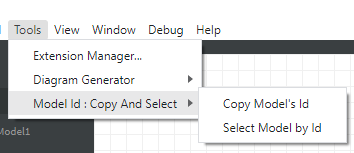

# About

This is an extension for [StarUML.io](https://staruml.io/) S/W which aids the users to get access at the unique Model's IDs and make references to them at documentation and/or the source code. Given an Model's ID this extension can also automatically select it inside the StarUML software.

Thus as shown in the following image it provides two options:

1. **Copy Model's Id**: Copies to clipboard the model's Id. Then it can pasted anywhere where it is required (*for instance, in documentation, in source code comments e.t.c.*)
2. **Select Model by Id**: Having copied a model Id to clipboard, this second options selects the model in the file. To this end with Ctrl+E the user can find it directly in the Explorer window, and with Ctrl+D to find it in a used diagram.

